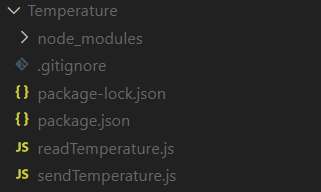
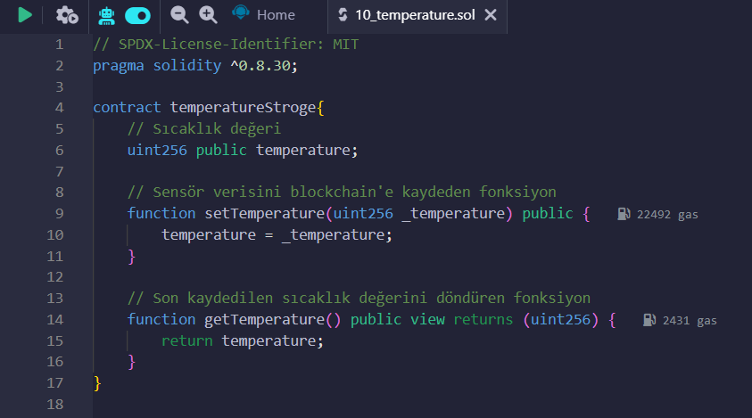
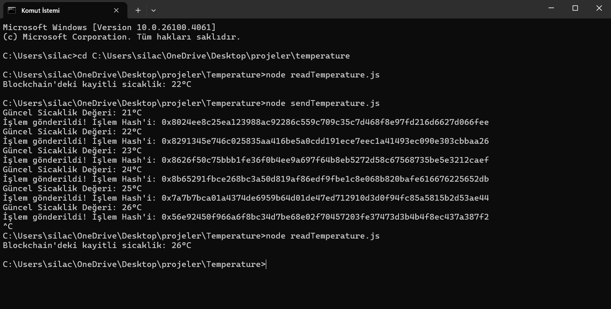
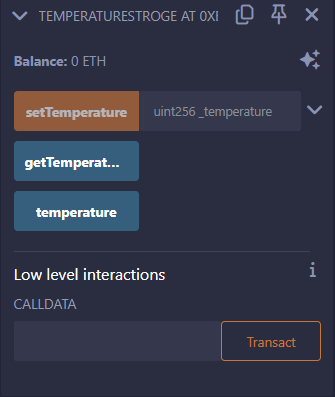

```
🌡️ Blockchain’e Sıcaklık Verisi Gönderme Projesi
```
Bu proje, simüle edilmiş sıcaklık sensor verisinin Ethereum Sepolia test ağına Solidity
akıllı kontratı ve Web3.js kullanılarak nasıl gönderileceğini göstermektedir. Ayrıca, bu
verilerin blockchain üzerinden nasıl okunacağını da içerir.

```
🛠️  Projede Kullanılan Teknolojiler
```
- Solidity (Remix IDE ile yazıldı ve deploy edildi.)
- Ethereum Sepolia Testnet
- Alchemy RPC
- MetaMask Cüzdanı
- Node.js
- Web3.js (v4.x)

```
📁  Proje Yapısı 
```


- senTemperature.js: Simüle edilmiş olan sıcaklık verisini Ethereum Sepolia test ağına yazan JavaScript dosyasıdır.  
- readTemperature.js Akıllı kontrattan sıcaklık verisini okuyan JavaScript dosyasıdır.  
- package.json: Projenin bağımlılıklarını ve metadata bilgilerini içerir.  
- .gitignore: `node_modules` gibi version kontrolüne dahil edilmeyecek dosyaları belirler.  
- node_modules: Web3.js gibi kütüphaneleri içeren klasördür (yüksek boyutlu olduğu için `.gitignore` içinde yer alır).  


```
🧠 Nasıl Çalışır
```
1. Her 15 saniyede 20- 30 °C arasında döngüsel bir sıcaklık verisi üretilir.
2. Bu değer, Sepolia test ağına deploy edilmiş bir akıllı kontrata
    setTemperature() fonksiyonuna gönderilir.
3. Akıllı kontrat, temperature değişkenini günceller.
4. getTemperature() fonksiyonu ile sıcaklık blockchain’den okunabilir.


```
📜 Kod Özeti
```
Akıllı kontrat fonksiyonları Remix IDE platformunda geliştirildi.



sendTemperature.js
Web3 ile Alchemy RPC bağlantısını kurar, sıcaklık verisini üretir ve kontrata gönderir.

readTemperature.js
Kontratın getTemperature() fonksiyonunu çağırarak blockchain’deki güncel sıcaklık
değerini terminalde gösterir.

```
⚙️ Kurulum
```
1. Proje dizinine git:  
   ```bash
   cd "C:\Users\silac\OneDrive\Desktop\projeler\Temperature"
2. Gerekli Bağımlılıkları Yükle: 
    ```bash
    npm install
3. Uygulamayı Çalıştır:
    ```bash
    node sendTemperature.js **#** sıcaklık gönderimi
    node readTemperature.js **#** sıcaklık okuma
```
🧪 Örnek Çıktı
```
Bu ekran görüntüsü, sendTemperature.js dosyasının çalıştırılmasıyla simüle edilen sıcaklık verilerinin sırasıyla blockchain'e gönderildiğini göstermektedir. Her sıcaklık değeri için işlem başarılı şekilde gönderilmiş ve işlem hash'leri terminalde listelenmiştir. Ardından readTemperature.js komutu ile en güncel sıcaklık değeri blockchain'den başarıyla okunmuştur.



Bu görüntü Remix IDE üzerinde deploy edilmiş TemperatureStorage kontratının arayüzünü göstermektedir. Kontrat fonksiyonları arasında setTemperature (sıcaklık değeri yazma), getTemperature ve temperature (değer okuma) yer almaktadır. Buradan manuel olarak sıcaklık değeri girilerek işlem başlatılabilir.



```
📹 Demo videosu
```
Bu video, merkeziyetsiz IoT uygulamaları ve veri güvenliği konularında temel düzeyde fikir vermek amacıyla hazırlanmıştır.

[Demo Videosu Görüntüle](https://youtu.be/0Ukz0dBuihl)


```
📚 Kaynakça
```
Bu kaynaklar proje geliştirme sürecinde araştırma, yöntem belirleme ve kod örneği
inceleme aşamalarında kullanılmıştır. Web3.js dokümantasyonu direk kodlamada,
Hackernoon makalesi kavramsal altyapıda, Github projesi ise yapı ve mantık
kurgusunda referans alınmıştır.

Web3.js resmi dokümantasyonu: https://web3js.readthedocs.io/

HackerNoon: https://hackernoon.com/the-blockchain-iot-tech-stack-163dd1d59d

Github referans projesi: https://github.com/Nilssmt/iot-blockchain-prototype

ChatGPT (OpenAI)

Claude.ai

```
🧾 Lisans
```
Bu proje MIT lisansı ile lisanslanmıştır. Özgürce kullanılabilir, geliştirilebilir ve
paylaşılabilir.


